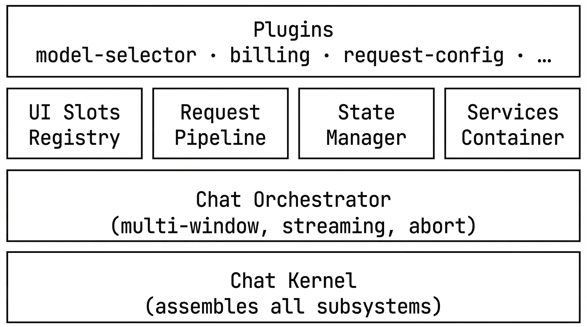

# Chat Kernel

A plugin-based chat UI framework built with React 19 and Vercel AI SDK. The microkernel architecture separates a minimal, stable core from extensible business logic — everything from model selection to billing is a plugin.

## Features

- **Microkernel + Plugin Architecture** — Small core with 17 built-in plugins. Add, remove, or replace any feature without touching the kernel.
- **Multi-Model Support** — OpenAI (GPT-4o, GPT-4.1) and Google (Gemini) out of the box. Per-message model ID tracking with header display. Easily add more via Vercel AI SDK providers.
- **PK Mode** — Side-by-side model comparison. Send the same prompt to multiple models simultaneously.
- **Streaming Responses** — Real-time text streaming with reasoning/thinking display, generated image preview, and token usage stats.
- **Rich Message Content** — Markdown + LaTeX rendering, code highlighting, file attachments (images & documents), collapsible thinking sections. Extensible via `markdownExtensions` service (custom rehype plugins and components).
- **Session Management** — Multi-session support with create/switch/delete/rename. Auto-naming from first message.
- **Persistence** — Pluggable `NetworkService` interface. Built-in localStorage implementation with auto-save.
- **Artifact Rendering** — `<antArtifact>` tag support with inline cards, side panel preview, fullscreen mode, and streaming display.
- **Configurable Request Params** — Temperature, topP, maxTokens, seed, stop sequences, penalties, reasoning effort, thinking budget, response format, system prompt — all with per-parameter enable/disable toggles. Supports per-window overrides.
- **Image Generation** — Aspect ratio and resolution config for supported models (e.g. Gemini image generation).
- **Chat Memory Control** — Context window slider and "New Session" markers to manage conversation context.

## Architecture



### Plugin System

Every plugin implements a simple interface:

```typescript
interface ChatPlugin {
  id: string;
  setup(ctx: PluginContext): void;
  dispose?(): void;
}
```

`PluginContext` provides four subsystems:

| Subsystem | API | Purpose |
|---|---|---|
| `ctx.ui` | `register(slot, item)`, `registerMessageRenderer(renderer)` | Inject UI into named slots or customize message rendering |
| `ctx.requests` | `register(id, hooks)` | Hook into `onBuildRequest → onBeforeSend → onStreamChunk → onAfterResponse / onRequestError` |
| `ctx.state` | `registerSlice(name, initial)`, `getSlice`, `setSlice`, `subscribe` | Manage reactive state slices |
| `ctx.services` | `register(name, factory)`, `get(name)` | Share services between plugins via lazy-singleton IoC |

### UI Slot Layout

```
┌───────────────────────────────────────────────────────────┐
│ [sidebar:left] │ [toolbar:left]         [toolbar:right]   │
│                │ [panel:header]                            │
│  Session       │  User Message (right-aligned blue bubble) │
│  List          │  Assistant Message:                       │
│                │    [message:header]  ← model name, etc.  │
│                │    [message:reasoning]                    │
│                │    Content (Markdown + extensions)        │
│                │    [message:files]                        │
│                │    [message:footer]                       │
│                │  [message:streaming]                      │
│                │  [message:error]                          │
│                │ [panel:footer]                            │
│                │ [input:composer]                          │
│                │   [input:actions]              [Send/Stop]│
└───────────────────────────────────────────────────────────┘
```

### Request Pipeline

```
onBuildRequest → onBeforeSend → streamText (fullStream) → onStreamChunk → onAfterResponse
                                                                           onRequestError
```

Plugins can inject model selection, headers, parameter overrides at `onBuildRequest`; intercept at `onBeforeSend`; observe chunks in real-time; and react to completion or errors.

## Built-in Plugins

| Plugin | Description |
|---|---|
| `model-selector` | Model dropdown + per-message model header + capabilities service |
| `input-composer` | Full input area with textarea, attachment preview, send/stop controls |
| `file-upload` | Image and document attachment support |
| `request-config` | 15 request params (temperature, topP, maxTokens, seed, stop, penalties, reasoning, thinking budget, etc.) with per-param toggles and per-window overrides |
| `billing` | Billing mode state, usage tracking, custom request headers |
| `pk` | Side-by-side multi-model comparison mode |
| `streaming-indicator` | Phase indicator: sending → thinking → outputting |
| `message-reasoning` | Collapsible "Thinking" section for reasoning models |
| `message-files` | Generated image display within messages |
| `message-usage` | Token usage stats (input/output tokens) per message |
| `error-display` | Structured error card with status code, error type, request ID |
| `auto-scroll` | Auto-scroll to bottom after AI response |
| `image-config` | Aspect ratio + resolution config for image generation models |
| `chat-memory` | Context window slider + "New Session" markers |
| `artifact` | `<antArtifact>` tag rendering with inline cards, side panel preview, fullscreen, and streaming support |
| `network` | Persistence layer — save/restore sessions, blob upload/download |
| `session-list` | Multi-session sidebar with create/switch/delete/rename, auto-save |

## Quick Start

### Prerequisites

- Node.js >= 18
- An OpenAI API key (and optionally a Google AI API key)

### Setup

```bash
# Clone the repo
git clone <repo-url>
cd zenmux-chat

# Install dependencies
npm install

# Configure environment
cp .env.example .env
# Edit .env with your API keys:
#   VITE_OPENAI_API_KEY=sk-your-key
#   VITE_OPENAI_BASE_URL=https://api.openai.com/v1
#   VITE_GOOGLE_API_KEY=your-google-key        (optional)
#   VITE_GOOGLE_BASE_URL=                       (optional)

# Start dev server
npm run dev
```

### Build

```bash
npm run build     # Type-check + production build
npm run preview   # Preview the production build
```

## Writing a Plugin

Here's a minimal plugin that adds a button to the toolbar:

```tsx
import type { ChatPlugin, PluginContext } from '@kernel/core';

export const MyPlugin: ChatPlugin = {
  id: 'my-plugin',
  setup(ctx: PluginContext) {
    // Register UI into a named slot
    ctx.ui.register('toolbar:right', {
      id: 'my-button',
      pluginId: 'my-plugin',
      order: 50,
      render: () => <button onClick={() => alert('Hello!')}>My Plugin</button>,
    });
  },
};
```

A more complete example with state, request hooks, and services:

```tsx
export const AnalyticsPlugin: ChatPlugin = {
  id: 'analytics',
  setup(ctx: PluginContext) {
    // 1. Register state slice
    ctx.state.registerSlice('analytics', { requestCount: 0 });

    // 2. Hook into request lifecycle
    ctx.requests.register('analytics', {
      onBeforeSend: (reqCtx) => {
        reqCtx.params.headers = {
          ...reqCtx.params.headers,
          'x-request-id': crypto.randomUUID(),
        };
      },
      onAfterResponse: () => {
        ctx.state.setSlice('analytics', (prev) => ({
          ...prev,
          requestCount: prev.requestCount + 1,
        }));
      },
    });

    // 3. Register a shared service
    ctx.services.register('analytics', () => ({
      getCount: () => ctx.state.getSlice('analytics').requestCount,
    }));
  },
};
```

Register your plugin in [App.tsx](src/app/App.tsx):

```tsx
kernel.registerPlugins([
  // ... built-in plugins
  MyPlugin,
  AnalyticsPlugin,
]);
```

## React Hooks

| Hook | Purpose |
|---|---|
| `useKernel()` | Access the kernel instance |
| `useSlotItems(slot)` | Subscribe to UI items in a named slot |
| `usePluginState<T>(slice)` | Read/write a plugin's state slice |
| `useOrchestratorState()` | Subscribe to orchestrator state (windows, active window) |
| `useMessageRenderers()` | Get all registered custom message renderers |

## Project Structure

```
src/
  app/App.tsx                        # Entry: kernel init, model config, plugin registration
  main.tsx                           # React mount
  kernel/
    core/
      types.ts                       # All core interfaces & types
      ChatKernel.ts                  # Kernel factory (assembles subsystems)
      PluginManager.ts               # Plugin registration & lifecycle
      ServiceContainer.ts            # Lazy-singleton IoC container
    ui/
      KernelProvider.tsx             # React context, hooks, SlotRenderer
      UISlotRegistry.ts             # Observable slot registry (cached)
      ChatPanel.tsx                  # Chat UI (virtualized messages, input)
      Toolbar.tsx                    # Top toolbar shell
    request/
      AIRequestPipeline.ts          # streamText pipeline with plugin hooks
      RequestLifecycleRegistry.ts   # Hook registry
    state/
      RuntimeState.ts               # Slice-based reactive state manager
    orchestrator/
      ChatOrchestrator.ts           # Multi-window chat orchestration
  plugins/
    model-selector/                  # Model dropdown + message header + capabilities
    billing/                         # Billing mode + usage tracking
    request-config/                  # 15 request params with per-window overrides
    artifact/                        # antArtifact tag rendering + preview panel
    file-upload/                     # Image/document attachments
    input-composer/                  # Input area with controls
    auto-scroll/                     # Scroll-to-bottom behavior
    message-usage/                   # Token usage display
    streaming-indicator/             # Streaming phase indicator
    error-display/                   # Structured error cards
    message-reasoning/               # Collapsible thinking sections
    message-files/                   # Generated image display
    pk/                              # Side-by-side model comparison
    image-config/                    # Image generation settings
    chat-memory/                     # Context window control
    network/                         # Persistence layer
    session-list/                    # Multi-session management
```

## Tech Stack

- **React 19** — UI framework
- **Vercel AI SDK** (`ai` + `@ai-sdk/openai` + `@ai-sdk/google`) — Model providers and streaming
- **Vite 7** — Build tooling
- **TypeScript 5** — Strict mode
- **Ant Design 6** — UI components
- **@lobehub/ui** — Chat message rendering (Markdown, LaTeX, code highlighting)
- **react-virtuoso** — Virtualized message list

## License

MIT
